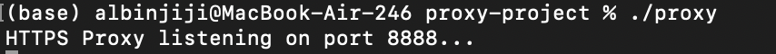
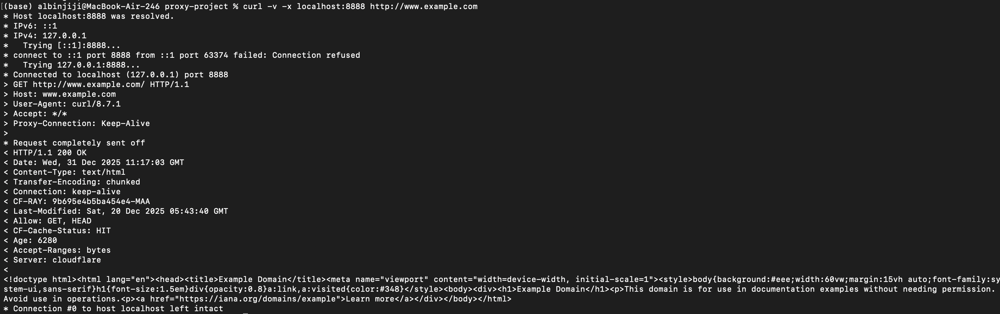
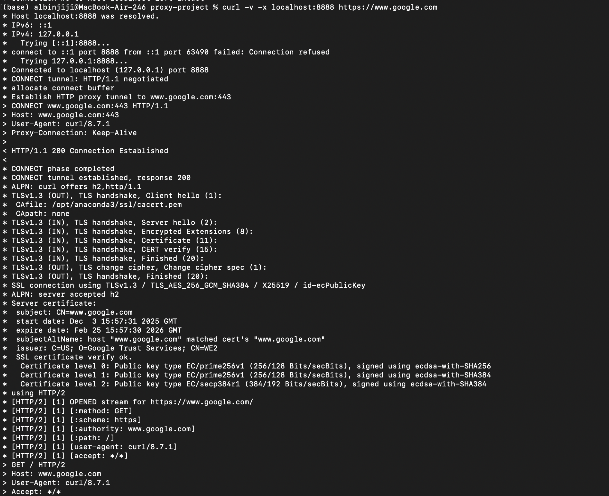
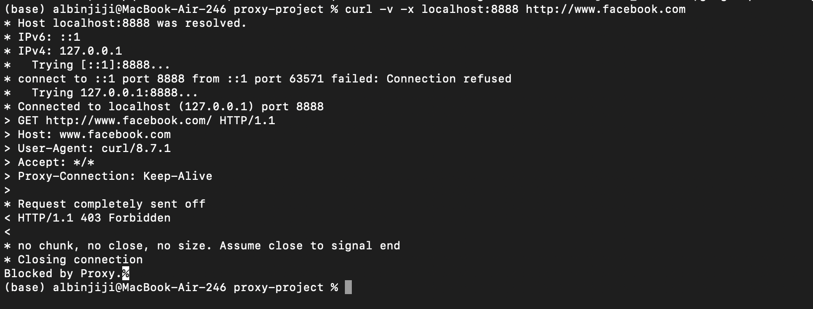
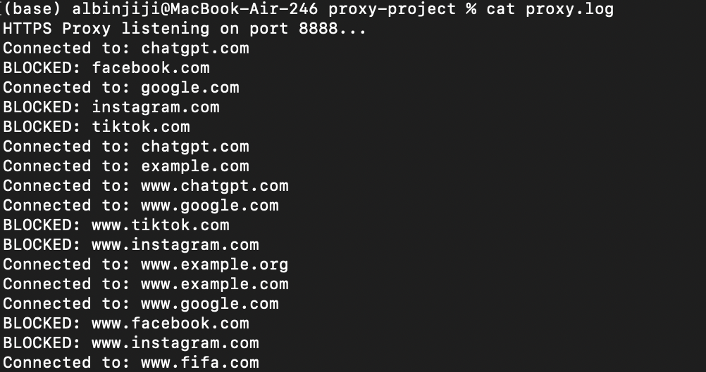
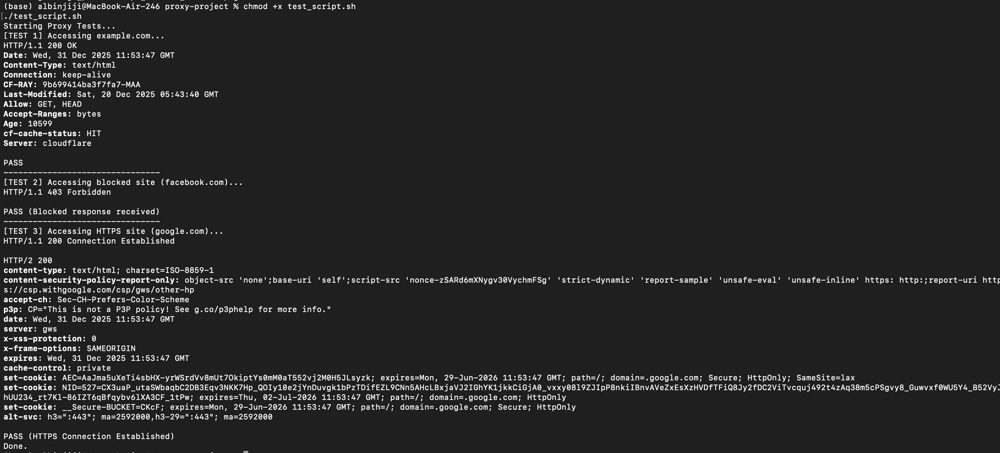

# C++ Multithreaded HTTP & HTTPS Proxy Server
**Developed by Albin Jiji**

## Project Overview
* It acts as an intermediary system that accepts client network requests.
* It handles TCP connections and parses HTTP requests.
* It relays server responses back to the clients and forwards traffic to destination servers.

## Features
* **TCP Socket Communication:** Built from scratch using standard POSIX socket libraries.
* **Concurrency:** Implements a thread-per-connection model to handle multiple clients simultaneously.
* **HTTPS Support (Extension):** Implements the `CONNECT` method to establish a TCP connection and tunnel encrypted traffic.
* **Domain Filtering:** Implements a rule-based blacklist mechanism to block specific domains via a configuration file.

## Directory Structure
* `src/proxy.cpp`: Main source code implementing the proxy server.
* `config/blocked_domains.txt`: Filtering rule file listing blocked domains.
* `DESIGN.md`: High-level architecture and design documentation.
* `Makefile`: Build instructions for the project.
* `test_script.sh`: Automated test suite for verifying functionality.

## How to Compile
Compile the project using the included Makefile:
```bash
make
```
## How to Run
Start the server (default listening on Port 8888):
```bash
./proxy
```
## How to Test
You can use the automated test script or manual commands to demonstrate usage

### 1. Automated Test Suite
**Note:** Ensure the script has execution permissions before running.
```bash
chmod +x test_script.sh
./test_script.sh
```
### 2. Manual HTTPS Tunneling Test
Verify that the proxy correctly handles secure `CONNECT` requests by tunneling the encrypted traffic
```bash
curl -v -x localhost:8888 https://www.google.com
```
### 3. Manual Blocked Site Test
Confirm that blacklisted domains listed in your configuration file are correctly filtered and blocked

```bash
curl -v -x localhost:8888 http://www.facebook.com
```
**Expected Output:** `Access Denied by Proxy: This site is blocked.`

---
## Proof of Functionality

### 1. Server Initialization


### 2. HTTP Request Success


### 3. HTTPS Tunneling (CONNECT method)


### 4. Domain Filtering (403 Forbidden)


### 5. Proxy Activity Logs


### 6. Automated Test Suite Results

